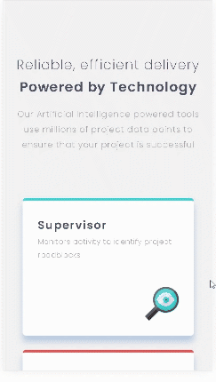
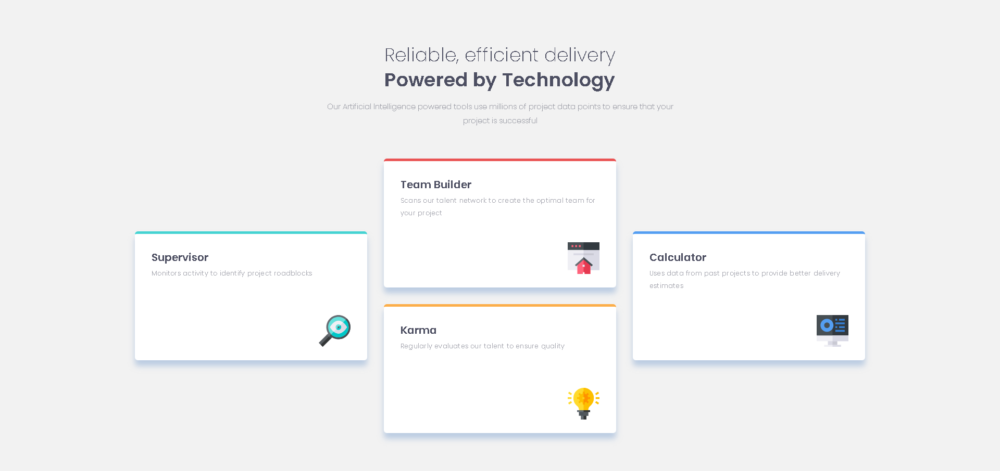
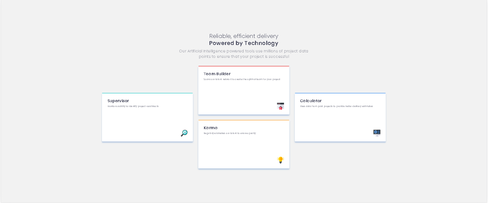

# Frontend Mentor - Four card feature section solution

This is a solution to the [Four card feature section challenge on Frontend Mentor](https://www.frontendmentor.io/challenges/four-card-feature-section-weK1eFYK).

## Table of contents

- [Overview](#overview)
  - [The challenge](#the-challenge)
  - [Screenshot](#screenshot)
  - [Links](#links)
- [My process](#my-process)
  - [Built with](#built-with)
  - [What I learned](#what-i-learned)
  - [Continued development](#continued-development)
  - [Useful resources](#useful-resources)
- [Author](#author)
- [Acknowledgments](#acknowledgments)


You should be able to:

- View the optimal layout for the site depending on your device's screen size

### Preview Of project
#### Mobile
.
#### Desktop

#### ultra-wide



### Links

- Repository URL: (https://github.com/Vilorshini0/four_card_featured_section)
- Live Site URL: (https://my-four-card-feature-section.netlify.app/)

## My process

### Built with

- Semantic HTML5 markup
- CSS custom properties
- Flexbox
- CSS Grid
- Mobile-first workflow


### What I learned

In this project i tried to implement the styles making use of variables/mixins. It's also a good and simple example of using grid layout for the card section.

```html using section tag
<section class="card supervisor">
  <div class="text">
    <h3>Supervisor</h3>
    <p>Monitors activity to identify project roadblocks</p>
  </div>
  <div class="image">
    
  </div>
</section>
```
```css using mixins
@include ultra-wide-only {
        max-width: 80%;
    }
```

### Continued development

It's my first time using Grid Layout and i found it very useful, will definitly try to implement and experiment further on this layout method.


## Author

- Website - [github profile](https://github.com/Vilorshini0)
- Linkedin - [@Vilorshini Ramsamy](https://www.linkedin.com/in/vilorshiniramsamy/)


